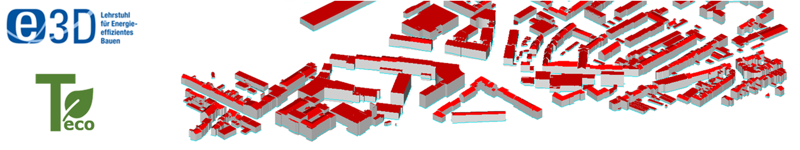

# Teco Installation Guide

Teco (TEASER+eco) is an **extension of [TEASER+](https://gitlab.e3d.rwth-aachen.de/e3d-software-tools/teaser)**, which
in turn extends the original [TEASER](https://github.com/RWTH-EBC/TEASER) tool. Teco does not vendor a copy of
TEASER+ — it depends on it as a **git submodule** and patches some of its modules at import time (see
[Why TEASER+ must be installed as a submodule](#why-teaser-must-be-installed-as-a-submodule-not-from-pypi) below).
Consequently, **this guide replaces the separate TEASER/TEASER+ installation instructions** — setting up Teco sets up
TEASER+ as well, there is nothing extra to install for it.

This guide only covers the **script-based / Python-API workflow**. The legacy graphical interface
(`teaser/teaserplus_gui.py`, `teaser/gui_functions.py`) is **no longer supported or maintained** and should be
considered a dead end — do not try to run or extend it. Everything below is written for using Teco from your own
scripts (see `teco/examples/`) or an IDE such as PyCharm.

## Table of contents

1. [Overview of required software](#1-overview-of-required-software)
2. [Install Dymola and its C++ compiler](#2-install-dymola-and-its-c-compiler)
3. [Install the AixLib Modelica library](#3-install-the-aixlib-modelica-library)
4. [Clone Teco (with the TEASER+ submodule)](#4-clone-teco-with-the-teaser-submodule)
5. [Set up the Python environment](#5-set-up-the-python-environment)
6. [Install TEASER+ from the submodule](#6-install-teaser-from-the-submodule)
7. [Install Teco's own dependencies](#7-install-tecos-own-dependencies)
8. [Set the Dymola environment variable](#8-set-the-dymola-environment-variable)
9. [Verify the installation](#9-verify-the-installation)
10. [Why TEASER+ must be installed as a submodule, not from PyPI](#why-teaser-must-be-installed-as-a-submodule-not-from-pypi)
11. [Troubleshooting](#11-troubleshooting)

## 1. Overview of required software

| Software | Purpose | Notes |
|---|---|---|
| [Dymola](https://www.3ds.com/products/catia/dymola) 2025x Refresh 1 | Simulates the Modelica model that Teco/TEASER+ generates from Python | Other recent Dymola versions likely work too, but 2025x Refresh 1 is the version actively verified with this repo |
| Visual C++ 2015, 2017, or 2019 redistributable/build tools | Dymola compiles the generated Modelica model via a C compiler | 2019 has been confirmed to work; you do not need the newest VC++ version |
| [AixLib](https://github.com/RWTH-EBC/AixLib) Modelica library | Modelica building/HVAC component library that the exported models are built on | See [section 3](#3-install-the-aixlib-modelica-library) for the required version |
| Python 3.10+ (3.12 verified) | Runs Teco/TEASER+ and drives Dymola via `buildingspy` | A virtual environment (`venv` or conda) is strongly recommended |
| A Python IDE (e.g. PyCharm) | Optional, but recommended for editing/running the scripts | Any editor works; PyCharm is what the group mostly uses |
| Git (with submodule support) | Clone Teco together with the TEASER+ submodule | See [section 4](#4-clone-teco-with-the-teaser-submodule) |

> **A note on OpenModelica:** `buildingspy` (and thus TEASER+'s `simulate()`) also supports
> [OpenModelica](https://openmodelica.org/) as a simulation backend via
> `buildingspy.simulate.OpenModelica.Simulator`. It is a supported code path, but **it has not yet been tested with
> Teco** — this guide and the rest of the group's workflow assume Dymola. If you try OpenModelica, treat it as
> unverified and expect to debug AixLib/OpenModelica compatibility issues yourself.

## 2. Install Dymola and its C++ compiler

1. Install **Dymola 2025x Refresh 1** using your institute/commercial license.
2. Install a **Visual C++ build environment** so Dymola can compile the generated models. Visual C++ 2015, 2017, and
   2019 have all been confirmed to work — you do not need the very latest version. If you don't already have one,
   the "Desktop development with C++" workload from the Visual Studio Build Tools installer is sufficient.
3. During Dymola setup, make sure the compiler is selected under Dymola's *Simulation → Setup → Compiler* settings.

## 3. Install the AixLib Modelica library

Teco/TEASER+ export Modelica models against the **AixLib** library by default (`Project.used_library_calc =
"AixLib"`). AixLib is **not a Python/pip package** — it is a Modelica library that must be available inside Dymola,
separately from your Python environment.

1. Clone or download [AixLib](https://github.com/RWTH-EBC/AixLib).
2. Check out (or download) **AixLib version 1.3.2**, which matches the version Teco/TEASER+ currently write into the
   exported model's `uses(AixLib(version="..."))` annotation
   (`teaser/teaser/logic/buildingobjects/calculation/aixlib.py`). If you use a different AixLib version, set
   `project.buildings[i].library_attr.version` accordingly before exporting, or Dymola will report a version
   mismatch when opening the generated package.
3. Open `AixLib/package.mo` once in Dymola so it is registered as a Dymola library, or add the AixLib root folder to
   Dymola's library path (*File → Libraries → Setup Libraries...*, or set the `MODELICAPATH` environment variable).

> If you use `used_library_calc = "IBPSA"` instead, the version requirements differ (see
> `teaser/teaser/logic/buildingobjects/calculation/ibpsa.py`); AixLib 1.3.2 is the default and the version this
> guide focuses on.

## 4. Clone Teco (with the TEASER+ submodule)

TEASER+ lives in `teaser/` as a **git submodule**, so clone with `--recurse-submodules`:

```bash
git clone --recurse-submodules <teco-repository-url>
cd teco
```

If you already cloned without that flag, initialize the submodule afterwards:

```bash
git submodule update --init --recursive
```

Teco and TEASER+ are developed in lockstep: when you switch Teco to a feature branch (e.g. `hub4lca_archetypes`),
check whether the `teaser` submodule should be on the matching branch of the
[TEASER+ repository](https://gitlab.e3d.rwth-aachen.de/e3d-software-tools/teaser) as well, and pull/update the
submodule if so:

```bash
cd teaser
git fetch
git checkout <matching-branch>
cd ..
```

## 5. Set up the Python environment

Teco is developed with **Python 3.10+** (3.12 is what the current development environment uses). Create and
activate a virtual environment before installing anything:

```bash
python -m venv .venv
# Windows
.venv\Scripts\activate
# Linux/macOS
source .venv/bin/activate
```

A distribution like [WinPython](https://winpython.github.io/) or [Miniconda](https://docs.conda.io/) also works and
already ships several of the scientific packages Teco needs.

## 6. Install TEASER+ from the submodule

**Do not `pip install teaser` from PyPI.** Install the `teaser/` submodule in *editable* mode instead:

```bash
pip install -e ./teaser
```

This pulls in TEASER+'s own dependencies (`mako`, `pandas`, `numpy`, `lxml`, `buildingspy`, `pyproj`) automatically.
See [section 10](#why-teaser-must-be-installed-as-a-submodule-not-from-pypi) for why this step is mandatory rather
than just a recommendation.

## 7. Install Teco's own dependencies

From the repository root, install Teco itself and its remaining dependencies:

```bash
pip install -e .
pip install -r requirements.txt
```

`requirements.txt` currently covers:

| Package | Notes |
|---|---|
| `buildingspy` | Drives the Dymola/OpenModelica simulation from Python (`buildingspy.simulate.Dymola.Simulator`). Verified with 5.2.0; older 2.x releases predate that API. |
| `citydpc` | Parses the CityGML files used as geometry input. Required by `teaser.data.input.citydpc_input`, but not declared by TEASER+'s own `setup.py` — install it explicitly. |
| `lxml` | CityGML/Energy ADE XML (de)serialization. |
| `openpyxl` | Needed only if you use the `.xlsx` archetype-assignment workflow (e.g. `teco/examples/e6_multi_building_gml_lca_manual_assign.py`, the `bausim_2026_full.xlsx` use case). |
| `Mako`, `pandas`, `pytest` | Templating, data handling, and the test suite. |

`SDF`, `PySide6`, and `NCDataReader2` were previously listed here for the graphical interface
(`teaser/teaserplus_gui.py`, `teaser/gui_functions.py`). **That GUI is deprecated and unsupported** — you do not
need these packages for the normal script-based workflow, and they have been removed from `requirements.txt`. Only
install them if you are specifically investigating the legacy GUI code, which is not recommended.

## 8. Set the Dymola environment variable

So that `buildingspy` can find and launch Dymola from Python, add Dymola's `bin64` folder to your `Path`
(user or system) environment variable:

1. Search "Environment Variables" in Windows and open *Edit the system environment variables* → *Environment
   Variables...*.
2. Under either "User variables" or "System variables", select `Path` → *Edit...* → *New*.
3. Add the path to your Dymola 2025x Refresh 1 installation's `bin64` subfolder, e.g.:

   ```text
   C:\Program Files\Dymola 2025x Refresh 1\bin64
   ```

4. Confirm with OK on all dialogs and **restart any open terminal/IDE** so it picks up the new `Path`.

## 9. Verify the installation

With the virtual environment active and Dymola/AixLib installed, run one of the example scripts, e.g.:

```bash
python teco/examples/e6_multi_building_gml_lca_manual_assign.py
```

or run the test suite:

```bash
pytest
```

If Dymola opens and simulates a model without complaining about a missing or mismatched AixLib version, and the
script produces its GWP/LCA CSV output, the installation is complete.

## 10. Why TEASER+ must be installed as a submodule, not from PyPI

Teco does not subclass TEASER+'s classes in the usual Python way. Instead, importing the `teco` package
(`teco/__init__.py`) triggers `teco/teco_module_modifications.py`, which **rewrites `sys.modules`** so that when
TEASER(+) code later does e.g. `import teaser.logic.buildingobjects.building`, it transparently receives Teco's own
`teco.logic.buildingobjects.building` module instead — that's how Teco's LCA methods (`calc_lca_data`,
`add_lca_data_heating`, ...) end up on TEASER's `Building`/`ThermalZone`/`BuildingElement` classes.

This has two practical consequences:

- **You need the exact TEASER+ fork in `teaser/`**, not the vanilla `teaser` package from PyPI. The public PyPI
  package doesn't have the CityGML/Energy ADE and hub4lca-archetype features this fork (and Teco) rely on, and pip
  would otherwise happily install the wrong "teaser" package and shadow the submodule.
- **Import order matters in your own scripts.** Teco's own modules (e.g. `teco.project`) must be imported *before*
  any `teaser` archetype/CityGML module. See the module docstring of
  `teco/examples/e5_multi_building_gml_lca.py` for a worked example and the exact pitfalls (in particular, re-import
  `get_default_path`/`get_full_path` from `teco.logic.utilities`, not from `teaser.logic.utilities`, once the patch
  has run).

## 11. Troubleshooting

- **`ModuleNotFoundError: No module named 'teaser'` despite installing requirements** — you likely skipped
  `pip install -e ./teaser` ([section 6](#6-install-teaser-from-the-submodule)), or cloned without
  `--recurse-submodules` so `teaser/` is an empty folder.
- **Dymola complains about an AixLib version mismatch** — the AixLib library loaded in Dymola doesn't match the
  version Teco wrote into the exported package (`library_attr.version`, default `1.3.2`). Install matching AixLib,
  or set `library_attr.version` before exporting.
- **`buildingspy` cannot find/launch Dymola** — check that the `Path` variable from [section 8](#8-set-the-dymola-environment-variable)
  points at the correct `bin64` folder and that you restarted your terminal/IDE afterward.
- **Importing `teaser.logic.utilities` fails with `AttributeError`** — see the import-order note in
  [section 10](#why-teaser-must-be-installed-as-a-submodule-not-from-pypi); import `teco.project` (or another `teco`
  module) before any `teaser` submodule that needs the patched utilities.
