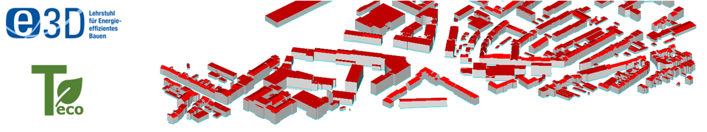

# Teco - An extension to the TEASER+ tool for environmental impacts of buildings

<!----->

The Teco extension is developed by members of the "Institute of Energy Efficiency and Sustainable Building (e3D), RWTH Aachen University" using Python 3.10+.
This extension is based on TEASER+ as well as the "Tool for Energy Analysis and Simulation for Efficient Retrofit (TEASER)" and can be used to import and export CityGML data sets with or without Energy ADE version 1.0. 
The Teco extension aims to help simulation scientists facilitate the determination of environmental impacts (prominently GWP) using basic input and CityGML models.

If you have any questions regarding Teco feel free to contact us at: [schildt@e3d.rwth-aachen.de](mailto:schildt@e3d.rwth-aachen.de).

If you have any questions regarding TEASER+ feel free to contact us at: [shamovich@e3d.rwth-aachen.de](mailto:shamovich@e3d.rwth-aachen.de) or [cityatb@e3d.rwth-aachen.de](mailto:cityatb@e3d.rwth-aachen.de).

## Description
 
Ambitious sustainability and carbon reduction goals in the building sector require the large-scale determination of environmental impacts. Building energy demands in the operational phase are a crucial element to be considered. To fully reflect the building life cycle, emissions from all life phases - construction, operation, dismantling, re-usage - have to be analysed. This goes in accordance with the 11th United Nations Sustainable Goal of making cities and human settlements sustainable. 
At the same time, this analysis is generally data-intensive. With the increasing availability of 3D building models, particularly CityGML datasets, using such data is advantageous to the UBEM community and the life cycle assessment workflow. Since CityGML data is mainly geometric, Teco offers an enrichment procedure for building materials, utilities and respective environmental indicators based on DIN EN 15804. Thus, the Teco extension enhances the existing feature set and abilities of the TEASER+ tool, and allows the integration of 3D city models for urban-scale, ecological life cycle assessments.

## Version

The current version of Teco is 0.6.0. The release introduces more functionalities of the GUI (started by running gui/teaserplus_gui.py), including a full simulation setup with buildings from CityGML, manually added buildings, and an LCIA result display.
 
The TEASER+ used for this version is in turn based on TEASER 0.7.6.  
Teco uses OEKOBAUDAT EPDs according to EN 15804+A1.

## How to use Teco

Teco is an enrichment framework based on TEASER+ with a range of dependencies.
It is currently being developed using Python 3.10+.

### Installation

Teco can be used by cloning or downloading the whole Teco package from the GIT Repository. 
The TEASER+ repo needs to be installed analogously, as a dependency in a Python environment (use of development branch is encouraged). 
Teco uses a range of libraries, the installation of which can be simplified by using the provided requirements.txt file.
A Modelica-based simulation environment needs to be installed, including the Aixlib library version 1.0.0.

### Dependencies

 Beside the basic dependencies from the TEASER tool, Teco uses BuildingsPy version 2.0.0 to automate the simulation process. The current developments of Teco use lxml for importing and exporting CityGML datasets with or without the Energy ADE.
More dependencies can be found in the requirements.txt file.

### How to contribute to the development of Teco

You are invited to contribute to the development of Teco. You may report any issues by sending us an email to [schildt@e3d.rwth-aachen.de](mailto:schildt@e3d.rwth-aachen.de).

## How to cite Teco
Heuristic Urban-Scale Life Cycle Assessment of Districts to Determine Their Carbon Footprints. Schildt, M., Cuypers, J. L., Malhotra, A., Shamovich, M., Frisch, J., van Treeck, C.. In Proc. 2022 Building Performance Analysis Conference and SimBuild co-organized by ASHRAE and IBPSA-USA (Vol. 10, pp. 309-317), September 2022, Chicago USA.
[Link to publication](https://doi.org/10.26868/25746308.2022.C035)

### Teco-related publications
+ On the Potential of District-Scale Life Cycle Assessments of Buildings. Schildt, M., Cuypers, J. L., Shamovich, M., Herzogenrath, S. T., Malhotra, A., van Treeck, C., Frisch, J. In Energies 2023, 16(15), Special Issue Energy Efficiency through Building Simulation, June 2023. [Link to publication](https://doi.org/10.3390/en16155639)
+ Sensitivity analysis of building archetypes for the life cycle assessment of districts. Schildt, M., Ponec, A., Tayeb, Y., Cuypers, J. L., Frisch, J., van Treeck, C. In Proc. 2023 Building Simulation 2023, 18th International IBPSA Conference and Exhibition, September 2023, Shanghai China.

## How to cite TEASER+
Urban energy simulations using open CityGML models: A comparative analysis. Malhotra, A., Shamovich, M., Frisch, J., & van Treeck, C.. Energy and Buildings, 255, 111658, January 2022.

### TEASER+-related publications
+ Parametric Study of the Different Level of Detail of CityGML and Energy-ADE Information for Energy Performance Simulations. Malhotra, A., Shamovich, M., Frisch, J., & van Treeck, C.. In Proc. 16th IBPSA Conf (Vol. 16, pp. 3429-3436), September 2019.

## How to cite original TEASER

+ TEASER: an open tool for urban energy modelling of building stocks. Remmen P., Lauster M., Mans M., Fuchs M., Osterhage T., Müller D.. Journal of Building Performance Simulation, February 2017,
[pdf](http://dx.doi.org/10.1080/19401493.2017.1283539),  
[bibtex](https://github.com/RWTH-EBC/TEASER/tree/master/doc/cite_jbps.bib)

### TEASER-related publications

+ CityGML Import and Export for Dynamic Building Performance Simulation in Modelica. Remmen P.,
Lauster M., Mans M., Osterhage T., Müller D.. BSO16, p.329-336, September 2016,
[pdf](http://www.ibpsa.org/proceedings/BSO2016/p1047.pdf),
[bibtex](https://github.com/RWTH-EBC/TEASER/tree/master/doc/cite.bib)

+ Scalable Design-Driven Parameterization of Reduced Order Models Using Archetype Buildings with TEASER.
Lauster M., Mans M., Remmen P., Fuchs M., Müller D.. BauSIM2016, p.535-542, September 2016,
[pdf](https://www.researchgate.net/profile/Moritz_Lauster/publication/310465372_Scalable_Design-Driven_Parameterization_of_Reduced_Order_Models_using_Archetype_Buildings_with_TEASER/links/582ee96908ae004f74be1fb0.pdf?origin=publication_detail&ev=pub_int_prw_xdl&msrp=eEyK6WYemhC8wK7xkMEPRDO4obE4uxBN4-0BdBy1Ldwhy9FhCe1pXfNObJYubvC_aZN0IWDPf9uayBo3u79bsZvg3hzUoLoYRatES2ARH8c.B2cYwSICt0IOa7lD-4oAiEa_3TtrO-7k-1W9chuNQwr_VNMCpZ5ubSb-eY2D77rGUP4S6wS8m6vudUUbMlXbQQ.Cledgd1Q9fPp11nYGpcpKNhSS6bVTqAEXeMZPkiV3HsJxcVWTFj4Hr_jmLZ0MOzDxbDEZObcGiKfmTL_9k_59A)

+ Refinement of Dynamic Non-Residential Building Archetypes Using Measurement Data and Bayesian Calibration
Remmen P., Schäfer J., Müller D.. Building Simulation 2019, September 2019,
[pdf](https://www.researchgate.net/publication/337925776_Refinement_of_Dynamic_Non-Residential_Building_Archetypes_Using_Measurement_Data_and_Bayesian_Calibration)

+ Selecting statistical indices for calibrating building energy models. Vogt, M., Remmen P., Lauster M., Fuchs M. , Müller D.. Building and Environment 144, pages 94-107, October 2018. [bibtex](https://github.com/RWTH-EBC/TEASER/tree/master/doc/cite_be.bib)

+  A parametric study of TEASER where all functions and  parameters used in TEASER are gathered and explained. The publication can be found [here](https://publications.rwth-aachen.de/record/749801/files/749801.pdf).

## License

Teco is released by RWTH Aachen University, e3D - Institute of Energy Efficiency and Sustainable Building, under the MIT License (see License.md).

## Acknowledgements

The developers of Teco would like to thank the Institute of Energy Efficient Building and Indoor Climate (EBC), E.ON Energy Research Center, RWTH Aachen University for their effort in developing TEASER and for making it available open-source. Furthermore, we would like to thank the German Federal Ministry of Housing, Urban Development and Construction for the ongoing development and open-source availability of OEKOBAUDAT.

